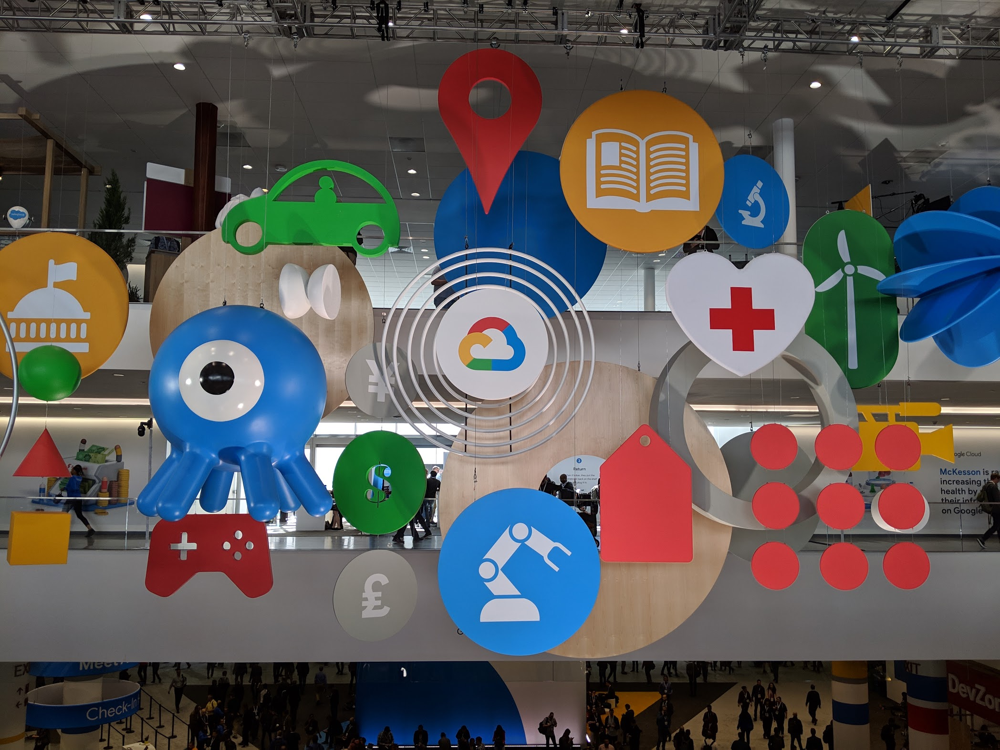

I had the opportunity to attend Google NEXT and SmashingConf SF 2019.
Both were in San Francisco, CA and within weeks of each other, so I dub this
the _Month of Conferences and Learning_. Both were multiple days and packed with
dense talks.

## Google NEXT (April 9-11)

NEXT is a huge conference thrown annually by Google to gather entrepreneurs, business
leaders, and developers to learn about the future of (Google) cloud and opportunities
with the latest technologies. It is multi-track, so it is _smart_ to plan ahead by
spending some time looking over the schedule to reserve a seat for the sessions you want to attend.

<figure>
  
  <figcaption>Entrance of Google NEXT hanging decor at Moscone South</figcaption>
</figure>

Many sessions were outside my repertoire, so it wasn't too difficult for me to
create an itenery without conflicts. I attended sessions related to Chrome browser,
Google App Engine/SPAs/ML, and inclusion/diversity. NEXT is probably one of the most
well organized, uncrowded, and well staffed major events I've ever attended. All of
the staff was very professional, from the speakers, to the security, to IT, all
the way to the kitchen crew, and cleaners, who spent time sorting through recycling
and compost (because people can't for the life of themselves seem to know what belongs where
and/or don't care).

### Highlights of NEXT

#### Chrome browser enterprise

- Legacy browser support (chrome m74-beta, stable coming soon)
- (enterprise) Version picking/locking/rolling back
- Password alert
- Search drive from omnibox
- Tab groups (for those who have tab attachment issues, ahha)

#### Business case for product inclusion

- Case study: original airbags killed more women than men tested, since dummies tested were just men dummies. 40% injury rate for women
- Case study: designing youtube for kids (text doesn't mean much to them, just visual and speech)
- Warning: data can be misleading. Phones in india are usually purchased by men but used by women. When using, it’s usually the men’s profile/account being signed into places. Data already starts with bias and therefore can lead you to make incorrect decisions for product).
- It is important to build a balanced team to create perspective. What miss opportunities and growth are you missing by exclusive? Who could you/your product be engaging with that you currently aren't? What can you learn there
- Pixar reshaped how they created short films by opening up pitches to the general staff. This opened up a breadth of new creative ideas and it was free.

#### Inclusion panel quotes

- Diversity is a reality, inclusiveness is a choice (SAP CEO quote).
- People need to overcome their unconscious biases
  social stereotypes about certain groups of people that individuals form outside their conscious awareness
  - Practice a prevention program to get feedback: ask why employees are here and why they are staying (as opposed to only doing exit interviews). You can learn a lot about your employees, what’s working well, and insights to what might not.
- Discrimination happens across the board
- Be proactive within, get feedback from up and down the organization.

<figure>
  
  <figcaption>Women of Cloud (from left to right):
  Christina Storm (UX Manager, Google),
  Michelle Duffy (SRE Director, Goodle),
  Anna Berenberg (Distinguished Engineer, Google),
  Grace Mollison (Cloud Solutions Architect, Google),
  Ines Envid (Group Product Manager, Google),
  Rae Wang (Group Product Manager, Google)
  </figcaption>
</figure>

#### Building a better mobile web (progressive web app)

- Engaging (ux, hardware, push notifications, creds), installable (add to homescreen, distribute through managed Play), reliable (offline, caching, roughly half of all connections come from 3G, fast (performance opt, perf budget)
- Case study: trivalgo, 67% retention after connection loss. Became reliable offline, cached assets, and allowed users to continue to use site w/ service workers

#### Google Contact Center AI and Salesforce Service Cloud Solution

- A customer service partnership to create next gen Hulu customer service tool.
- It delivers:
  - Live agent assistance, which surfaces articles and knowledge documents based on real-time interactions
  - Automatic topic determination, to help agents quickly resolve issues with AI-powered workflows and provide them with the ability to propose personalized and relevant upsells
- Dialogflow Enterprise Edition dev suite + Salesforce AI platform Einstein
  - enables businesses to create natural conversational experiences via intelligent chatbots (understanding capabilities including intent match, entity extraction, sentiment analysts, and live agent handoff)
  - Can answer questions and perform common tasks using data already captured
  - Support for 20+ languages

#### Laverne Cox (keynote)

<figure>
  
  <figcaption>Lavernce Cox owning her stage.  </figcaption>
</figure>

- I can easily say Laverne's talk was my FAVORITE thing about the conference,
  and it felt too short. She is an excellent, well spoken, highly intelligent, experienced
  speaker on inclusion, diversity, struggles, and is a strong advocate of LGBTQA rights.

- [Four I's of Oppression](https://www.teacherspayteachers.com/Product/The-Four-Is-of-Oppression-2836212)
  - Ideological (Ideas, eg, "White people are better, trans people are mentally ill)
  - Institutional (public policy, red lining in neighborhoods, gender binary model)
  - Interpersonal (language we use, microagressions)
  - Internalized (ex: when marginalized people think they are less than others)

> "We are a culture adverse to vulnerability" - Laverne Cox

- Community resiliency model: establish stable zone and skills for self-care and to share with your community. It teaches you how to balance a nervous system impacted by personal or community-level trauma (such as violence, poverty, racism and homophobia).

> "Empathy is the antidote to shame." - Laverne Cox

- Studies show that speaking to another person out of empathy will cause the shame to dissipate by 85%. However, we need to build safe spaces to do this.

> "Priveledge means you don't have to think about stuff." - Laverne Cox

- Priveledge is highly dependent on the room you are in (eg: context).
  - Try talking less if you have priveledge.
  - If you do not have priveledge, speak up.

#### Other small things

- Google Hangouts live auto transcription
- Autodesk ported over Autocad to _webassembly_, can use in web.

Overall, I was a little disappointed at the quality of the inclusion and diversity panels.
They were very shallow and only scratched the surface of the issues we see. Everyone agreed there
is a lack of diversity and inclusion within tech in general and it can be better, but none shared
solutions or plans, and only provided the beginnings of conversations. I guess that is better
than nothing?

I was hoping to see these bigger companies show some kind of initiative on a larger scale since
they work at companies that (seem) to have the resources to do so, and (may) be in positions
to do something about it.

Laverne's talk by itself stood out as an excellent example the conference should follow. She
provided statistics, facts, experience, relatable content with solid stories, and examples
of what she has done to make lives better for the community.

---

## SmashingConf SF (April 15-17)

SmashingConf is held annually in San Francisco (and other parts of the world)
by [Smashing Magazine](https://www.smashingmagazine.com/). I think this editorial
is the oldest one I've been following since the early days in my career, yet this is my
first time attending.

Note that there was an option to attend some workshops on days before/after the
conference. I opted in to attend the one

<figure>
  
  <figcaption>Chris Coyier asking what defines a frontend develop</figcaption>
</figure>

This is a much smaller and intimate single track conference consisting of
mostly only designers and frontend engineers. Most talks were filled with UI/UX content
(very up my alley), with a mixture of technical and non-technical sessions.

One fun bit: every goodie bag you got during badge pickup had a balloon. As a
part of the opening ceremony, the audience blew up their balloons and threw them
up in celebration. It was very exciting and a great way to start the day, full
of energy and a sense of community.

<figure>
  
  <figcaption>Celebratory balloons</figcaption>
</figure>

Most were insightful, especially the accessibility ones. There was only one talk that
was catered to more non-technical folk (eg, the designers in the house) and the
topic was demystifying GIT. I use GIT on a day-to-day basis, but I could see how
useful it was for non-technical people to understand what GIT is used for, how
it is useful, and most importantly, why it is not magic and how it is fairly simple
once you break it down. Take away: do not be afraid of tools and learn their benefits!

## Highlights of SmashingConf

### Compression

- [Brotli](https://github.com/google/brotli): A data format specification for data streams compressed with a specific combination of the general-purpose LZ77 lossless compression algorithm, Huffman coding and 2nd order context modelling.

  - [Brotli vs Gzip Compression. How we improved our latency by 37%](https://medium.com/oyotech/how-brotli-compression-gave-us-37-latency-improvement-14d41e50fee4)
  - Bbrowser support built into browser (future compatible).
  - Lossless and compression and decompression.
  - Significantly slower at compressing, but provides better ratio to savings than gzip
  - Ideal for serving static text based content (css, html, js, svg).
  - Advantage for large files
  - Decompression is fast, comparable to zlib
  - Served only through https

- [Lepton](https://github.com/dropbox/lepton): A tool and file format for losslessly compressing JPEGs by an average of 22%.
  - Lepton achieves a 22% savings reduction for existing JPEG images, by predicting coefficients in JPEG blocks and feeding those predictions as context into an arithmetic coder.

### Image Tricks

- [Sapporo Case Study](https://peterhrynkow.com/how-to-compress-a-png-like-a-jpeg/)
- Get the compression of a JPEG with the transparency of a PNG

### Email

- Litmus: build, test, and analyze email campaigns
  - [Email images and defensive design](https://litmus.com/blog/email-pixel-art-the-rarest-and-coolest-defensive-design-tactic)
  - Lots of crazy highly interactive stuff you can do with punch-card like state management with radio+checked pseudo-class in css. [Interactive email with accordians](https://litmus.com/builder/86117f8)
- [Gamification](https://email.trendyminds.com/t/ViewEmail/d/1B18DB24A3E233E3/4006C484FAE38D46EBAD456BEB5F1DD6)
- [Zurb Ink](https://zurb.com/ink/): a responsive email framework

### Performance

- [Differential Loading w/ Jeremy Wagner](https://calendar.perfplanet.com/2018/doing-differential-serving-in-2019/)

<figure>
  
  <figcaption>Differential loading before and after statistics</figcaption>
</figure>

### Typography

- Dynamic Web Typography: [FF Meta Variable Font Demo](https://codepen.io/jpamental/full/MGEPEL)
- [MDN Guide + interactive examples](https://developer.mozilla.org/en-US/docs/Web/CSS/CSS_Fonts/Variable_Fonts_Guide)

<figure>
  
  <figcaption>Variable webfont example</figcaption>
</figure>

### Other Tricks/Things

- [SVG Trace placeholder]([https://codepen.io/ainalem/full/aLKxjm/)
- [Can I stop using IE11?]([https://canistop.net/)
- [Glenn's goofy optimization(?) of html class names](https://glenmaddern.com/) (view the source)

<figure>
  
  <figcaption>All my smashing notes, surrounded by balloons</figcaption>
</figure>

If you are a frontend engineer (or work full-stack) or are a designer, or interested
in UI/UX, I cannot recommend SmashingConf highly enough.
