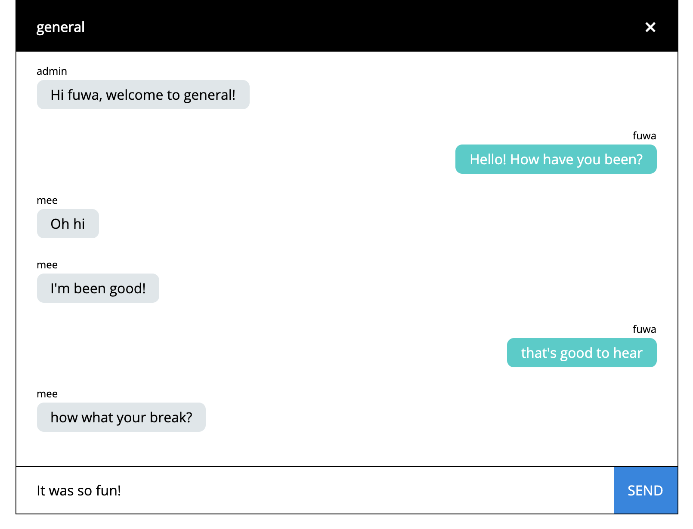

|   |   |
|---|---|
|  Purpose |  To create a real-time chat application and learn the basics of Sockets.io |
|  Project Dates |  January 22, 2020 |
| Technologies  | NodeJs/Express, React, Styled Components, JavaScript, Socket.io |
| Repository | https://github.com/meechanism/chatapp |

I haven't played around with [Socket.io](https://socket.io/)'s event-driven real-time API before. I thought it would be a perfect candidate for creating a chat application.

<figure>
  
  <figcaption>Two users engaging in chat</figcaption>
</figure>

## Concept

The idea was to have a simple web-based chat application relay messages between users.

- Users can join on a landing page where they input their name and a channel they want to join.
- Both fields be free-form for the prototype.
- Mimic a standard social media chat interface where other users appear on the left and the current user's message are on the right.


## Client and serverside tools

I decided to use [Create React App](https://create-react-app.dev/) to quickly get the web application running and removed most of the boilerplate.

I used [styled-components](https://styled-components.com/) to create declarative, functional, and composable units of UI components.

To handle state, I used [React Hooks](https://reactjs.org/docs/hooks-intro.html).

[Socket.io's client](https://github.com/socketio/socket.io-client) was used to connect and manage the socket on the client-side.

For the server, I used [ExpressJS](https://expressjs.com/) + Socket.io to handle realtime events. The server will also handle some simple user management.

## Sockets on the client-side

I found the Socket.io [client api](https://socket.io/docs/client-api/) to be fairly straight-forward. Their documentation provides ample examples and descriptions for writing the basic needs of this chat application.

At first, I wasn't sure how and where I would integrate the client-side, but it turns out all you have to do is add a couple `useEffects` to handle some events.

- Add a `useEffect` for handling when the component renders. Within it, we want to do two important things:
    - Setup the connection with the [io](https://socket.io/docs/client-api/#IO) function, which will return to you a new socket connection
    - Add the user to the specified channel. We can let the server know what the user and channel are by [emitting](https://socket.io/docs/client-api/#socket-emit-eventName-%E2%80%A6args-ack) a `join` event and passing along that data. The server can then do some user management.
    - Additionally, we only want to set up the socket and join for a user once, so for the initial `useEffect`, add the socket endpoint and user data as the re-render skip-effect arguments. Example:
        ```js
        useEffect(() => {
        // ...
        }, [IO_ENDPOINT, USER_DATA]);
        ```

- To handle dismounts, return a function within your `useEffect` that will [emit](https://socket.io/docs/client-api/#socket-emit-eventName-%E2%80%A6args-ack) a disconnect method so your server will handle that user appropriately.
- To handle incoming messages, subscribe to the `message`  event with the [on](https://socket.io/docs/client-api/#socket-on-eventName-callback) method.
- To send a message to the channel,  [emit](https://socket.io/docs/client-api/#socket-emit-eventName-%E2%80%A6args-ack) with the event `message` and provide the user and message as payload.

The server will take care of the rest!

## Sockets on the server-side

For setting up Sockets on the server, we need to do the following:

- Set up an event  [on](https://socket.io/docs/server-api/#socket-on-eventName-callback) listener for the `connection` event.
When we connect, we are provided a `socket` in the callback in which we can listen to the following events and handle them appropriately:
    - When a user `joins` a channel
    - When a user emits `sendMessage`
    - When a user disconnects
- Additionally, when a user joins or leaves, we can choose to [emit](https://socket.io/docs/client-api/#socket-emit-eventName-%E2%80%A6args-ack) a message to welcome/dismiss that user and also [broadcast](https://socket.io/docs/server-api/#Flag-%E2%80%98broadcast%E2%80%99) a message to all the other users in the channel about their updated status.

---

## Future improvements

This was very much an exercise in using Sockets.io, but it was a good start to a chat application foundation. In some future iterations, I can add the following changes:

- Create a drop-down menu with a premade list for channels or allow users to optionally create their own and then later users can optionally join their channels from that premade list.
- Be able to join multiple channels
- Channel management
- Proper state management
- Message history
- Channel status + user list

If you want to check out the project, [download the chatapp](https://github.com/meechanism/chatapp) over at the Github repository!