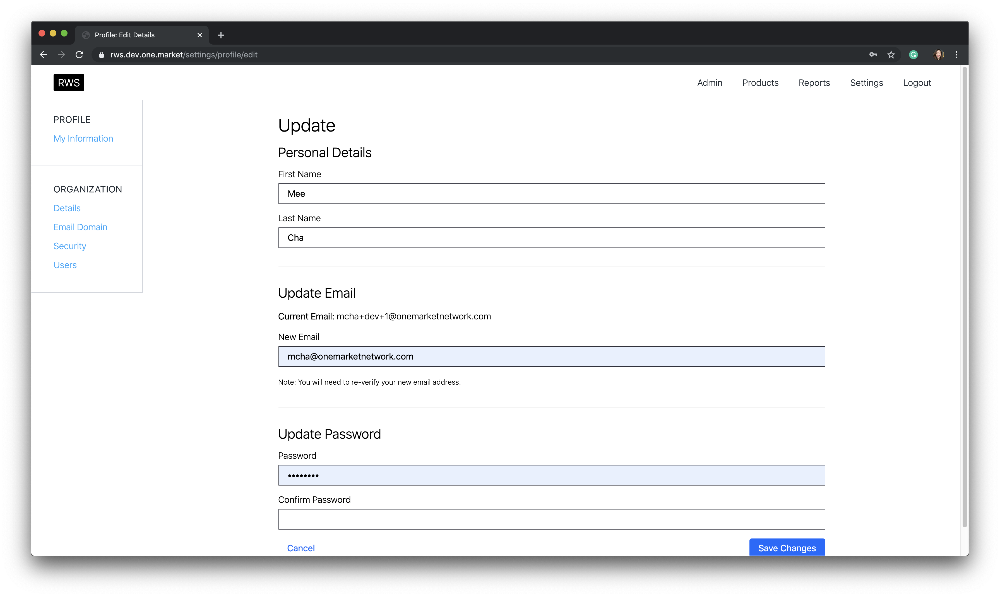
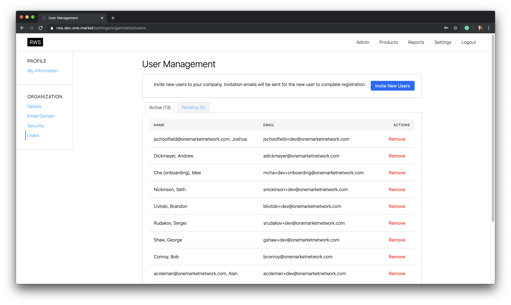
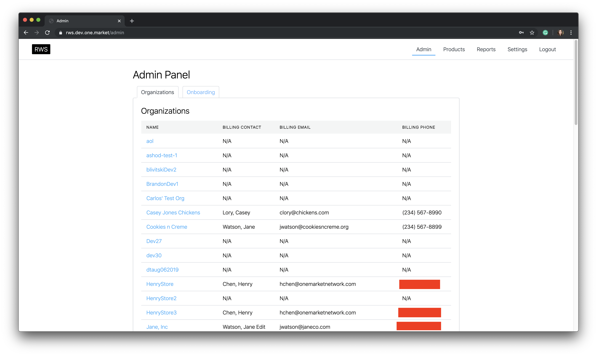
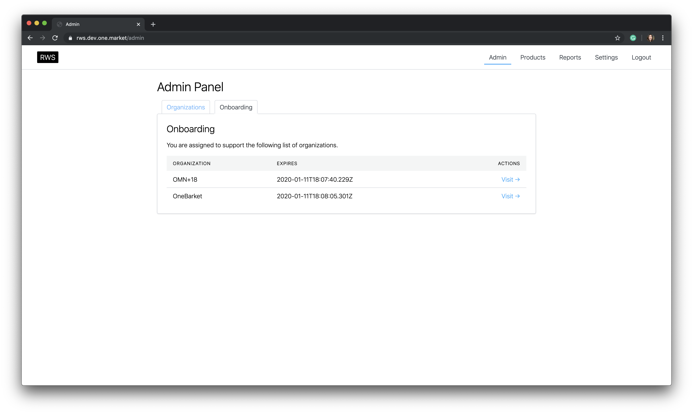
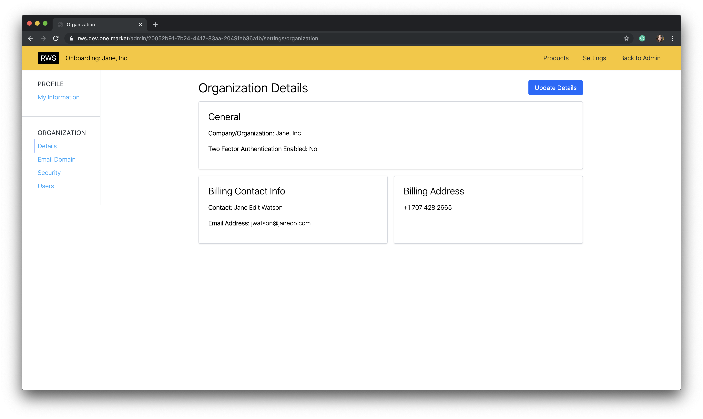
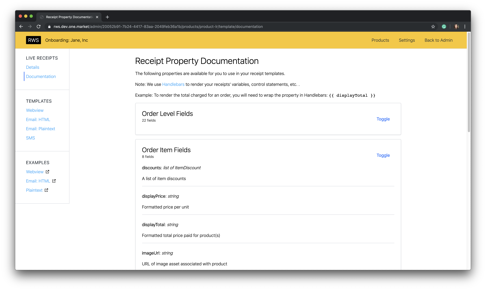
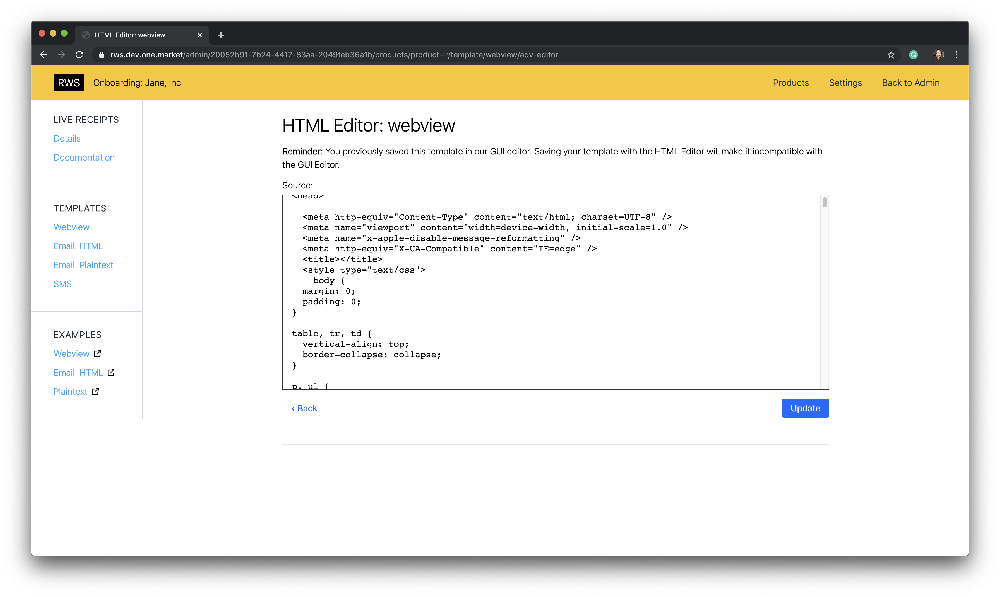
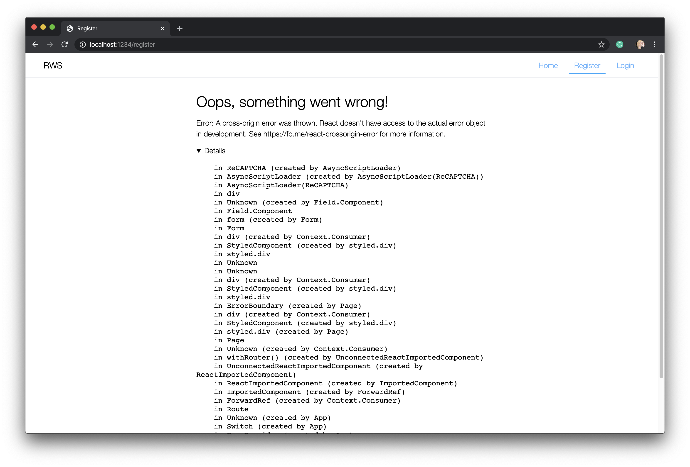

|   |   |
|---|---|
|  Employer |  OneMarket Network |
|  Project Dates |  Mar-Nov 2019 |
| Technologies  | NodeJs/Express, React, Styled Components, TypeScript, Apollo (GraphQL), PostgreSQL, Parcel, Ramda, server-side rendering  |
| Testing  |  Jest, Enzyme |
|  CI/CD |  CircleCI |
| Team  |  2 engineers, 1 engineering product |

OneMarket Network is a customer activation platform. The pitch:

> Seamlessly unify your data, easily make sense of it, and quickly activate engagements for more meaningful and profitable relationships with customers - all in a single platform.

The company closed its doors on December 3, 2019, which halted this project.

## My contributions

It's important to note the team did **NOT** have a design resource. About 99% of the
components (UI + UX), information architecture, and page layouts were designed and
implemented by me. I purposefully made everything very simple so it
would be easy to update the components (and global styles) or swap them out with
something that suits the future design's requirements.

Also, the team is *very* small. To break it down, there were two engineers, me being
the frontend, and one other doing primarily the backend. This isn't to say I
didn't work across the stack; I also wrote queries and mutations for feature
requests. The backend engineer also added in some pages and additional features
to existing parts of the app at times too.

#### Roles

If I have to break the work down to heavier frontend/backend tasks,
they look like this:

- Frontend: Routing, app architecture, components, page composition, templating/reusability
- Backend: GraphQL framework (automating resolver generation, auth, data caching, plugin architecture)

As a side note, the backend portion of RWS Web exists in an entirely different repository.
We called that *RWS Server* (very creative).

#### Specifications

We didn't have a traditional product manager for our team. Instead, the VP of
Engineering managed the schedule and was in charge of writing the stories. The
stories were merely descriptions of a user experience, allowing the engineers
the technical freedom to do whatever they deemed feasible. The mantras of engineering:

- Do it quick (don't spend too much time on it)
- Do it simple (remove complexity)

In other words, there was a lot of autonomy and the team would be broken if the
members weren't capable of working without a lot of direction.

## What is RWS Web?

The internal project name *RWS Web* is short for *Retailer Web Services*, the
platform handling all things related to partners (our customers), storing their
user data, allow access to APIs, and service configurations.

<figure>
  
  <figcaption>Update user profile page. Includes email verification.</figcaption>
</figure>

The *web* portion is the frontend facing UI/UX used by our partners to
set up their organization with our services. In short, it is a self-serve portal
enabling partners to register and sign up for our products without the need of
any assistance.

Note: The customer-facing name was never finalized, and neither were the designs.
Hence why the screencaps still have an awkward "RWS" in the header (something that means nothing to customers) and skeleton
designs.

<figure>
  
  <figcaption>Administrative user management page</figcaption>
</figure>

The goal is to provide a tool easy enough to use that greatly reduces the amount
of time our onboarding staff will have to spend with each partner. Of course, if
required, onboarding staff will have additional tools to sign on and assist
with the partner setup. This will operate more like a customer support role.

For some context, our previous partner onboarding experience required too much
hand-holding and several configurations had to be done outside of what the portal
offered. Exposing virtually all configurations in an application not only makes
setup more transparent, but enables partners to edit/see their settings at
their bidding.

<figure>
  
  <figcaption>Admin Panel: super admin (a special role) and onboarding role tabs. Real phone numbers have been censored. Tabs are only visible for users who are assigned those roles. If neither super admin or onboarding are applicable to a user for this URI, they get a forbidden message.</figcaption>
</figure>

The benefits of a self-serve tool are:

- Fewer resources tied up for partner onboarding and training
- Small/medium businesses can self-register and try the service
- Partner visibility and access to their service configurations

## Onboarding Context

As mentioned above, RWS Web still allowed internal onboarding staff to support
partners needing assistance. Only users with the assigned role "onboarding" can
be assigned a list of organizations to support.

<figure>
  
  <figcaption>A user with the onboarding role can see what partners they are assigned in the admin panel. Their access also has an expiration time.</figcaption>
</figure>

Selecting "Visit" for a partner will change the onboarding user's organizational context.

To indicate what context the onboarding staff is in, I added
the following changes to the header:

- A deep mustard background
- Name of the organization currently being supported
- Slightly different navigation. Onboarding cannot access "Reports" (a data analytics dashboard).
- Ability to exit onboarding context and return to the admin panel

<figure>
  
  <figcaption>Assigned onboarding staff is able to see the partner information for which they are supporting.</figcaption>
</figure>

When a signed-in user sees this UI header change, they will know they are currently *supporting a partner*.

<figure>
  
  <figcaption>Onboarding product setup</figcaption>
</figure>

## Struggles

With every project comes some struggles. Some can be seen upfront whereas others
linger deeper in the code.

#### Lack of designer

Putting aside the simplistic design, it was most apparent in the product configuration
pages. Specifically, one of the products we called
"Live Receipts" allows partners to customize the look and feel of their email and
webview receipts.

<figure>
  
  <figcaption>Onboarding product setup for configuring webview source</figcaption>
</figure>

The problem? We didn't know who we were catering to and didn't know how
to design the experience (or I didn't know how I was supposed to make the experience).

Because of this, I provided two options:

- A textarea copy/paste field to store a source (for more technical customers)
- A GUI drag/drop of various components available for the partner to add on a receipt (for non-technical customers)

For the latter, I ended up integrating a third-party tool that satisfied the bare
minimum requirements for allowing someone to drag/drop elements and edit CSS
styles. This UX wasn't ideal because users still had to manually write in the
handlebars variables into the sections of the template. (Apologies, I don't have a screencap of this).
This entirely didn't make sense if we wanted to use this for non-technical people.

However, I didn't think it was feasible to write up a whole drag/drop experience
or pay for something we're unsure about, so we decided to wait to see how
customers will respond before spending more time on it.

#### Product?

It was unclear who was driving the product direction for this project. I think
at this point, there was a lot of internal conflicts/politics between the
engineering team and product team. It was a bit uncomfortable for me because I have
previously been working very closely with the product team, so I kept approaching the product
person who I thought was going to cover this project with questions.

It ended up not being the case and it was very unclear to me who/what/why there
wasn't transparency around this. I think it brought team morale down.

## Upsides

I learned and got to play with a lot of new technologies and learned new things!

- Apollo (GraphQL implementation): Completely removed our need to implement a separate state management system (like redux). I love it so much!
- React Hooks: specifically, my favorite is "error boundaries" on both the global and component scale!

<figure>
  
  <figcaption>Error boundary in action. On a global level, catches the last error!</figcaption>
</figure>

## Conclusion

I didn't get to see this project run its course and get used by actual customers,
but I got to learn a lot about new tools and loved the level of autonomy. It's a
bit refreshing to be able to simply push out new things from scratch and not worry
about fixing layouts to meet design needs (just yet, but I do love the design iteration
process too). This felt purely like an
engineering exercise with the latest and greatest and I couldn't be happier to
be a part of it.