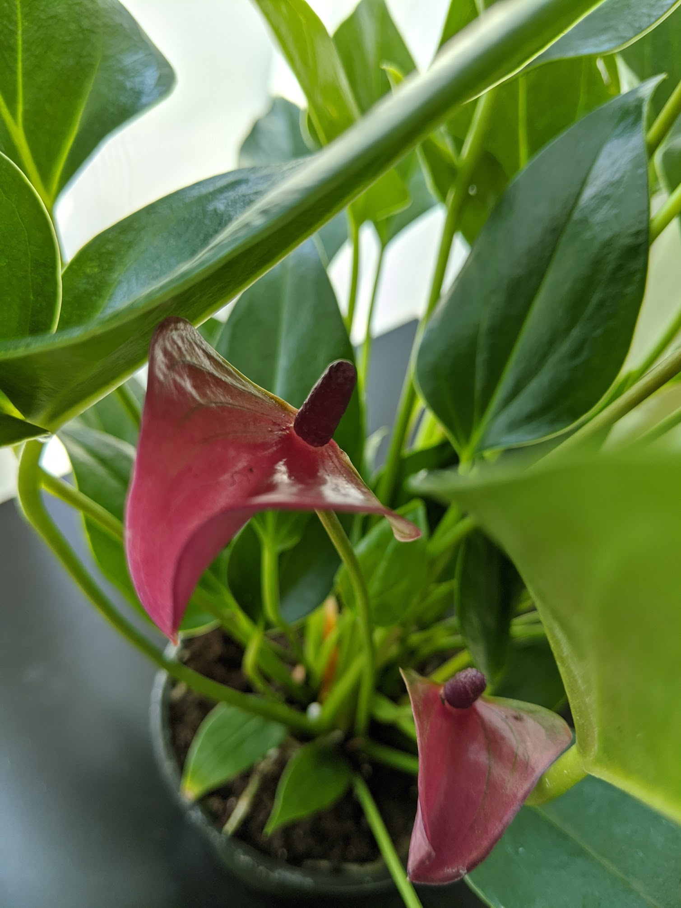
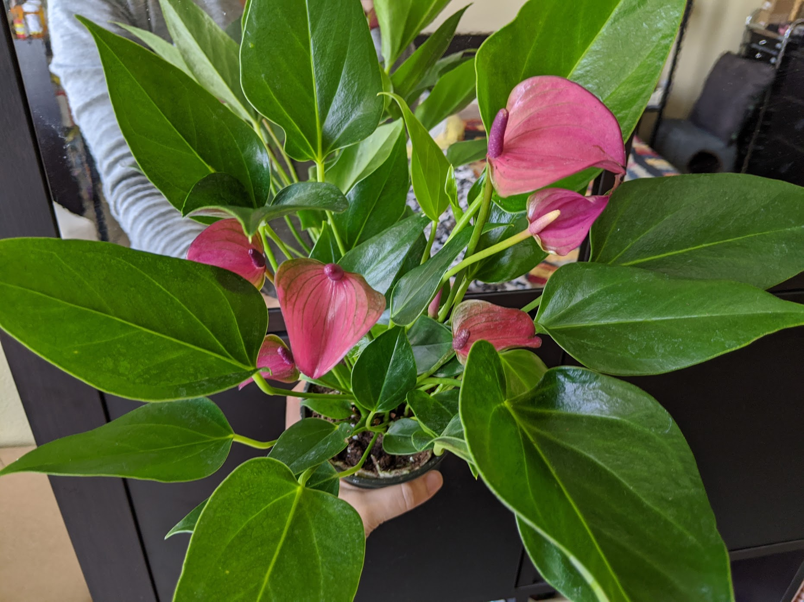
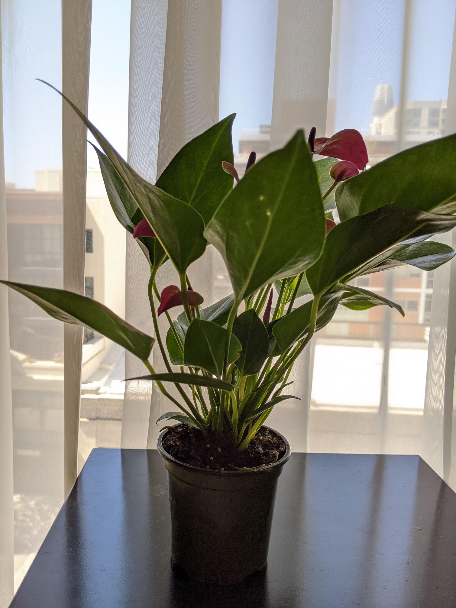

|           |                                                      |
| --------- | ---------------------------------------------------- |
| Since     | April 23, 2020                                       |
| From      | [Gabriella Plants](https://www.gabriellaplants.com/) |
| Condition | Healthy, pest-free, many flowers                     |

  <figure class="img--project">
    
    <figcaption>Taken 4/25/2020</figcaption>
  </figure>
  <figure class="img--project">
    
    <figcaption>Top down view voew</figcaption>
  </figure>
  <figure class="img--project">
    
    <figcaption>Side view</figcaption>
  </figure>

## General

- Native to Americas

## Difficulty

- Yellow leaves: too much direct sunlight or overwatering
- New flowers are green: too much sunlight

## Flowers

- Long lasting: 6-7 weeks

## Light

- Thrives in bright and indirect light
- No hot or direct light as it will burn the leaves
- low light = no flowers, but will still grow (albeit slower)

## Humidity

- Love humidity, 80% in winter
- Do not like dry air

## Watering

- Once a week, 2-3 weeks in winter, 5 days in summer
- Allow to dry out between watering. Soak soil, let drain
- Do not like continually moist soil, so let dry before watering again
- Don't bead water on leaves
- If the rootball become too dry, it will be difficult to re-wet. Soak the pot for an hour to rehydrate it.
- Susceptible to root rot!

## Pot Medium

- Epiphyte, so well draining
- 50/50 soil and perhaps orchid soil/perlite or moss

## Propagate

## Pet

- Toxic to cats and dogs

## Fertizilier

- Does not require much food
- 1/4 strength every 3-4 months
- For best blooms and roots, use one that is high is phosphorus (N*P*K)

# In my home

- Anthuriuum Dutch: 04/24/2020
