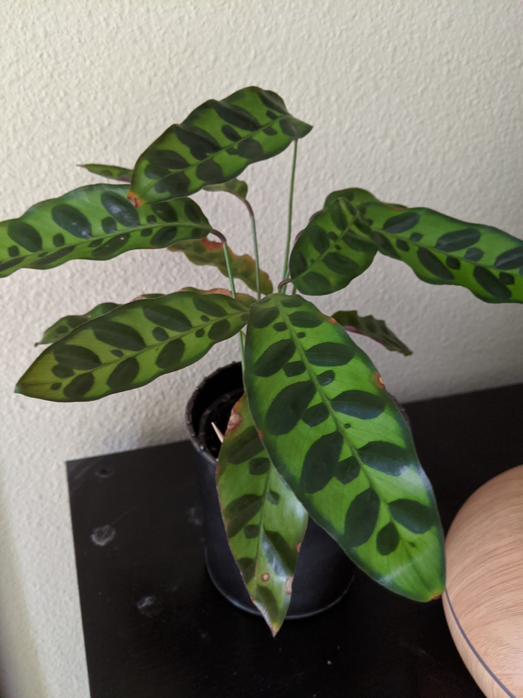
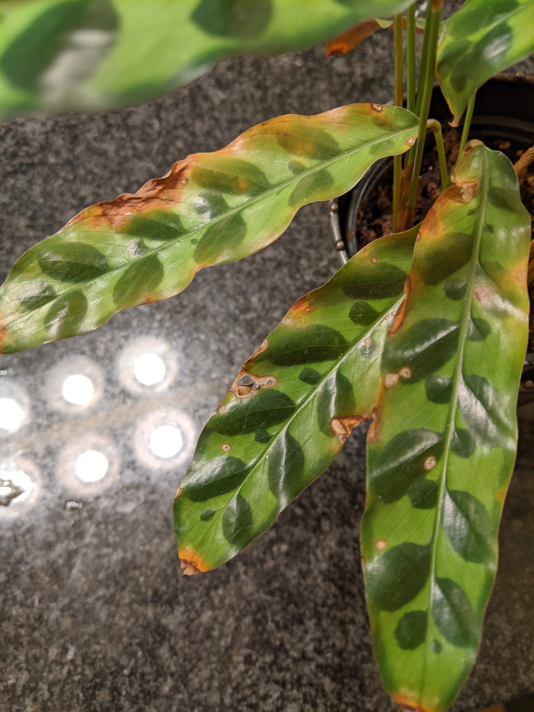

|           |                                    |
| --------- | ---------------------------------- |
| Since     | Dec 2019                           |
| From      | Adopted from old office            |
| Condition | Mostly healthy, some crispy leaves |

  <figure class="img--project">
    
    <figcaption>04/19/2020</figcaption>
  </figure>
  <figure class="img--project">
    
    <figcaption>04/19/2020 Crispy leaves!</figcaption>
  </figure>

## Difficulty

- Hard

## Light

- Low, indirect light
- Do not like a lot of direct sun
- Northern windows work well

## Humidity

-

## Watering

- 90% dry
- Not wet or sitting in water. Check soil every other day until you get the hang of it.
- No tap water! Minerals are bad. The leaves will get crispy!
- Distilled or rain water is best. Filtered is ok.

## Propagate

## Substrate

- 60/40 potting and cacti soil + perlite
- Keep moisture, but not allow for sitting in water

## Pet

## Fertizilier
