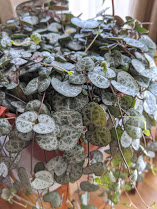
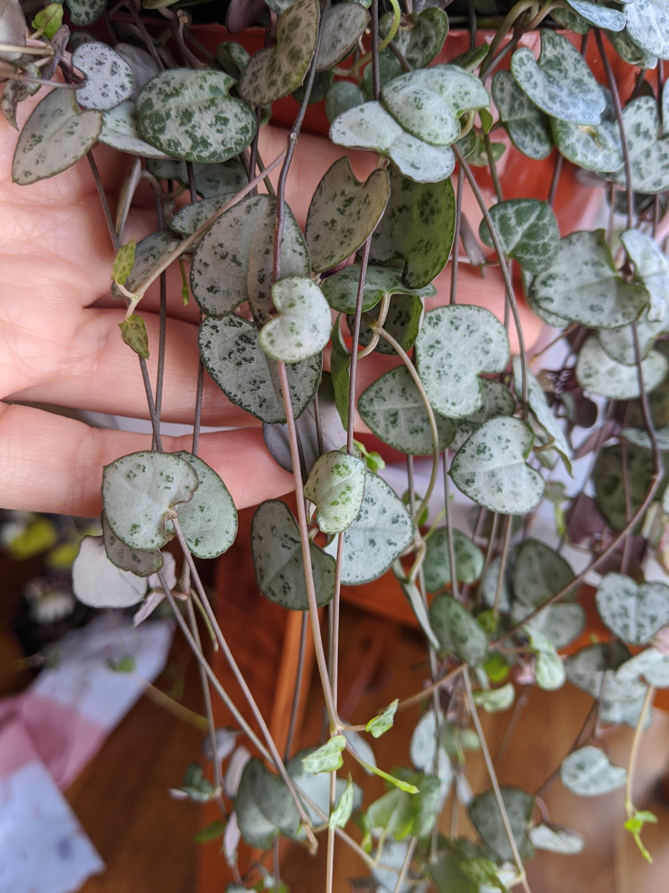

|           |                                            |
| --------- | ------------------------------------------ |
| What      | Ceropegia Woodii (String of Hearts)        |
| When      | May 1, 2020                                |
| From      | [SF Plants](https://www.sfplants.com/)     |
| Condition | 6 Inch, came in hanging planter, untangled |

## General

- Succulent-like

## Difficulty

-

## Light

- Bright indirect light
- A little direct morning sunlight OK
- A little direct evening sunlight OK
- Leaves will burn in direct light for too long
- Variegation will change depending on light exposure

## Humidity

-

## Watering

- More succulent, maybe every 2-3 weeks during growing season (spring-summer)
- Check if soil is completely dry.
- Water thoroughly when you do.
- Test mature leaves (closer to base of plant) to see if they are still firm. Lightly squeeze. If squishy/soft, it needs water.
- Prone to root rot

## Propagate

- Nodes/tubers, can place on top of soil and top off with a light layer of soil.
- Can water propagate cuttings (create node by cutting the hearts off). Submerge in water and place in bright indirect light. After a week or two, you should have an inch of roots.
- When you cut to propagate, in some cases it can create a split (promote growth)

## Pet

## Potting Medium

- Well draining, succulent mix, or 50% potting + 45% cacti mix + 5% perlite/orchid bark
- Like to be more root-bound and snug

## Fertizilier

-

## Pests

- Resilient, but probably more prone to mealy bugs
