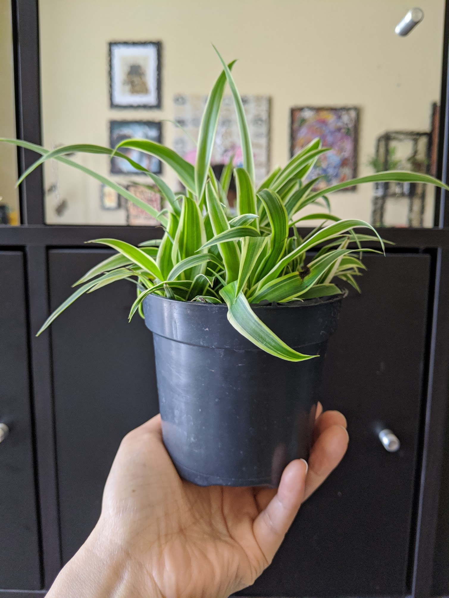

|             |                                                      |
| ----------- | ---------------------------------------------------- |
| Common Name | Spider Plant                                         |
| Since       | April 23, 2020                                       |
| From        | [Gabriella Plants](https://www.gabriellaplants.com/) |
| Condition   | Healthy, pest-free, 3 nodes                          |

Mine actually has a reversed variegation.

## Difficulty

- Generally easy
- Muted colors: needs water
- Brown strip through leaves: overwatered
- Crispy tips: under watered or too low humidity

## Light

- Indirect moderate, likes half shaded.
- Will burn in direct sun

## Humidity

- low humidity: crispy tips

## Watering

- Can dry out before watering
- Likes being moist in a well drained substrate

## Propagate

- Sprout babies shoot out and have visible roots. Can be separated from mom as soon as it has 5 leaves. 3cm roots for potting.
- Root division

## Substrate

- Regular potting soil
- pH 6-7, slightly acidic to neutral

## Pet

## Fertizilier

- 1:1:1
- Every 2-4 weeks during growing season (March to September)
