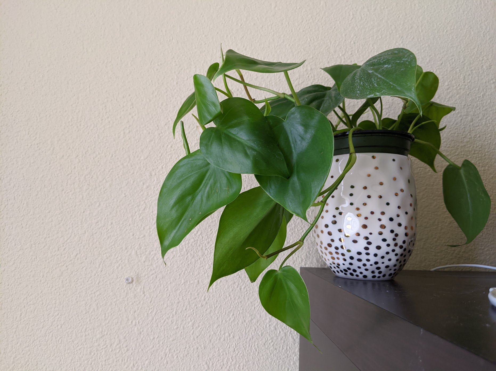

|             |                                                      |
| ----------- | ---------------------------------------------------- |
| Common Name | Heartleaf                                            |
| Since       | April 23, 2020                                       |
| From        | [Gabriella Plants](https://www.gabriellaplants.com/) |
| Condition   | Healthy, pest-free, 3 nodes                          |

## Difficulty

- Generally easy
- If leaves turn yellow, it means overwatered
- If wilting, underwtered
- Soft or black stems: rot or root disease

## Light

- Bright indirect light
- West/east window OK
- South facing 6-8ft back

## Humidity

- Like highs to promote faster growth
- Can survive in low, but won't grow as quickly

## Watering

- Allow to get fairly dry between watering
- Weekly OK
- Allow surface of soil to drive before watering.

## Propagate

- Can be done in Water
- Take cutting below node or aerial root. Cutting with at least 2 nodes better!
- Better in high humidity
- Wait for few inches root or proportionate to plant before potting in soil

## Pet

- Not pet safe. Keep away.
- Drooling, loss of appetite, vomiting
