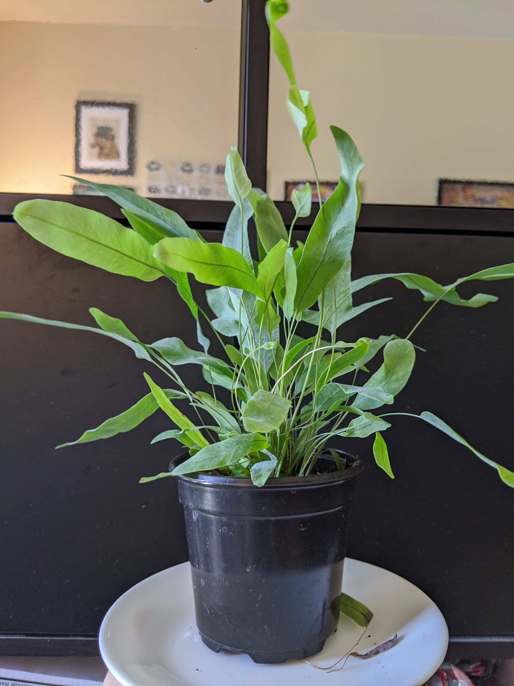
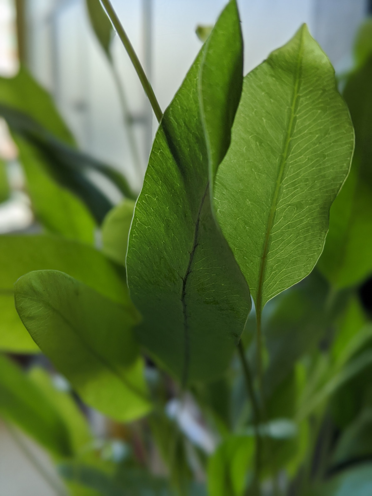
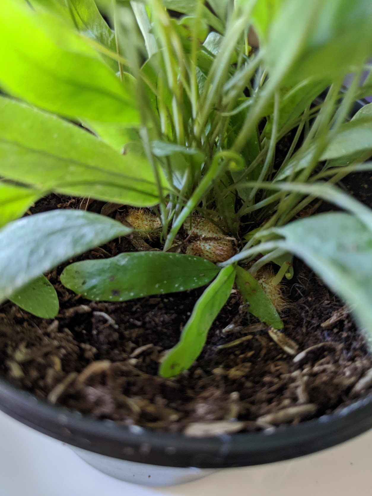

|           |                                                      |
| --------- | ---------------------------------------------------- |
| What      | Blue star fern                                       |
| When      | April 23, 2020                                       |
| From      | [Gabriella Plants](https://www.gabriellaplants.com/) |
| Condition | Healthy, pest-free                                   |

  <figure class="img--project">
    
    <figcaption>Taken 4/25/2020</figcaption>
  </figure>
  <figure class="img--project">
    
    <figcaption>Close up of blue star fern leaves. </figcaption>
  </figure>
  <figure class="img--project">
    
    <figcaption>Fuzzy rhizome exposed at the top of the soil (normal). Do not water on these! </figcaption>
  </figure>

## General

- Originates from Central/South America
- Can be found in Florida, USA
- Popular house plant

## Difficulty

- Easy for a fern
- Adaptable to room temperature

## Light

- Low, indirect light
- Leaves will burn in direct sun

## Humidity

- Love moist humid air (60-90%)
- Comes form tropical forests
- Putting close to other tropical plants are usually good enough

## Watering

- Avoid watering directly on the rhizome (mossy buldge)! See photos above for example.
- Bottom water!
- Medium and moist, but not wet
- Use finger and go to second knuckle to see if its dry, then water if it is
- Mist leaves every so often to keep leaves blue

## Propagate

- TBD

## Pet

- Non-toxic to pets

## Potting Medium

- Is a Epephite, make sure it is loose and well draining
- 60/40 soil and perlite
- Some orchid mix OK
- More acidic ok

## Fertizilier

- Dont go strong! Will hurt roots.
- Half strength, 1/4, monthly to every other month during growing season
- 1:1:1
- Iron, fish is good

## Pests

- Resilient, less pressure
