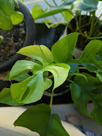

|           |                                                  |
| --------- | ------------------------------------------------ |
| What      | Rhaphidophora Tetrasperma                        |
| Purchased | May 1, 2020                                      |
| From      | [SF Plants](https://www.sfplants.com/)           |
| Condition | 4 Inch, pest-free, wilty, lightly damaged leaves |

## General

- Native to Thailand and Malyasia
- Can be from dry to moist forests
- Would benefit from a sphagnum pole
- Leaves will be larger and have more fenestrations if staked

## Difficulty

- Easy

## Light

- Bright diffused light
- Doesn't like direct light (will burn leaves)
- Has thin leaves, not waxy cuticles

## Humidity

- Likes humidity, moderate to high would be great, especially if light is more intense
- 60% would be good, but not picky if not available

## Watering

- Water right before when soil is dry (maybe an inch down or so)
- Stems will get brown if getting too dry
- Once a week is a good place to start
- Use filtered or distilled water

## Propagate

- TBD

## Pet

## Potting Medium

- Well draining
- Leave in nursury pot for as long as possible to get it to acclimate

## Fertizilier

- Gentle
- 20:20:20 bi-monthly or monthly during growing season
- Synthetic: cut in half!
- Can go higher on nitrogen to give healthy leaves

## Pests

- Pretty resilient, but can be prone to thrips (has thin leaves)
