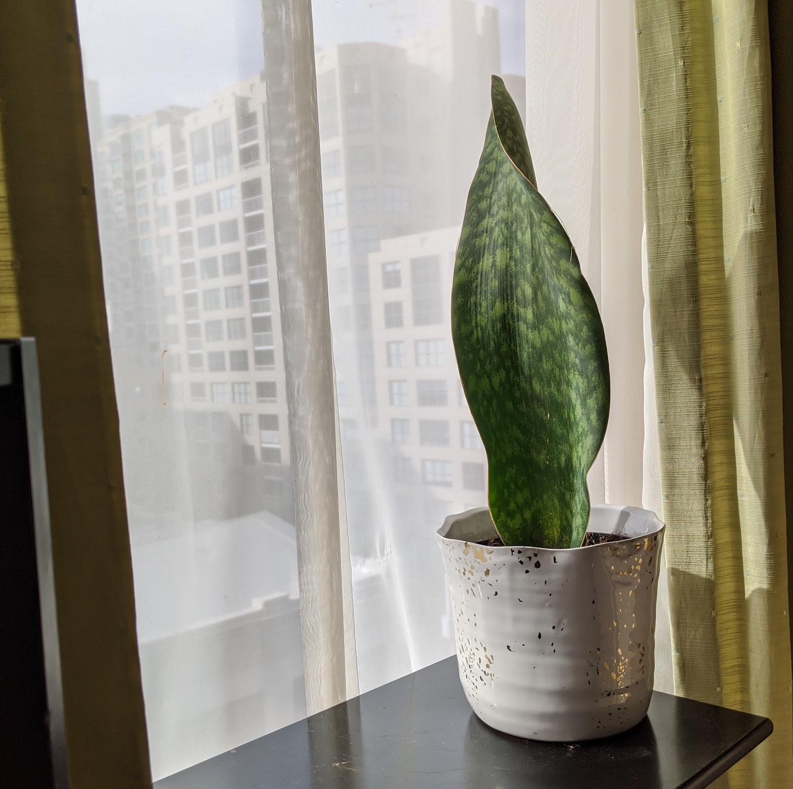

|           |                                                       |
| --------- | ----------------------------------------------------- |
| What      | Sansevieria Masoniana (Whale Fin)                     |
| When      | May 17, 2020                                          |
| From      | [Leafy](https://www.leafypaloalto.com/) from a friend |
| Condition | 6 inch pot, 39cm tall, great                          |

     <figure class="img--project">
        
        <figcaption>May 17, 2020</figcaption>
    </figure>

## General

- A part of the snake plant family.
- Sansevieria are unique in that they perform a specific type of photosynthesis at night which allows them to release oxygen throughout the night, unlike most other plants that release oxygen only during the day. This is why people prefer to have them placed in the bedroom.

## Difficulty

- Easy, low-maintenance, very forgiving

## Light

- Can tolerate low light
- Can benefit from direct light (preferred). Filter if too bright!

## Watering

- Dry out in between watering.
- Water thoroughly when it is time to water. Let excess drain.
- Can tolerate a little bit of leglect and extended dry periods

## Humidity

- Does not require extra humidity

## Propagate

- Slow grower!
- Division by root (fastest). If pot has more than 1 leaf, you can go this route.
- Water propagating a leaf cutting (~15 days - 2 months)
- Soil propagating a leaf cutting

For cuttings, use a healthy not too old leaf. You can cut a leaf into multiple segments. Just be sure to note which side you cut was closest to the soil as that side is the one that needs to go into the growing medium (otherwise it will rot). If water propagating, keep leafs at least an inch above bottom of glass.

Pot after an inch of roots grow.

## Pet

- Sansevieria family is mildy toxic to pets. When ingested, can cause drooling, vomiting, diarrhea, etc.
- [Source](https://www.petpoisonhelpline.com/poison/sansevieria/)

## Potting Medium

- Quick draining
- [Ohio Tropics](https://www.ohiotropics.com/2020/04/05/sansevieria-masoniana-whale-fin/) likes: 2 parts of a good succulent/cactus potting mix and add 1 part pumice.

## Fertizilier

- Light feeder
- Use a lower nitrogen fertilizer like 2-7-7 (Cactus) away from the base

## Pests

- Resilient. Watch for mealy bugs.
