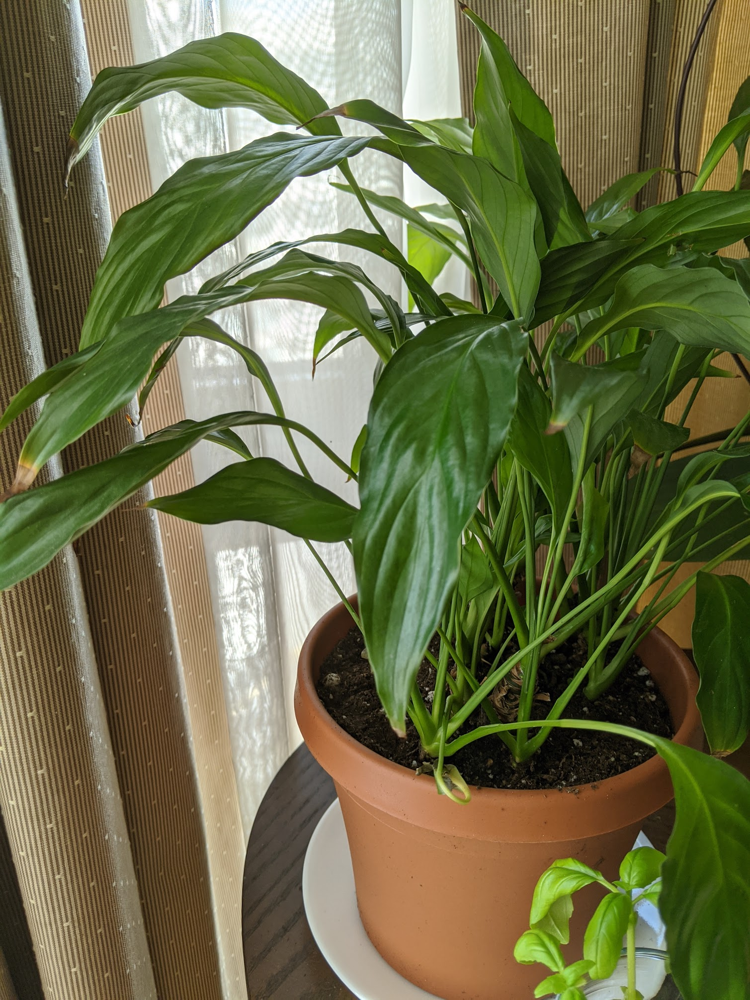

|           |                                     |
| --------- | ----------------------------------- |
| Since     | Sept 2017                           |
| From      | Adopted from old office             |
| Condition | Received super wilty (underwatered) |

My peace lily got really sad April 2020, so I opted to repot it in a 4.5 inch plastic potter
